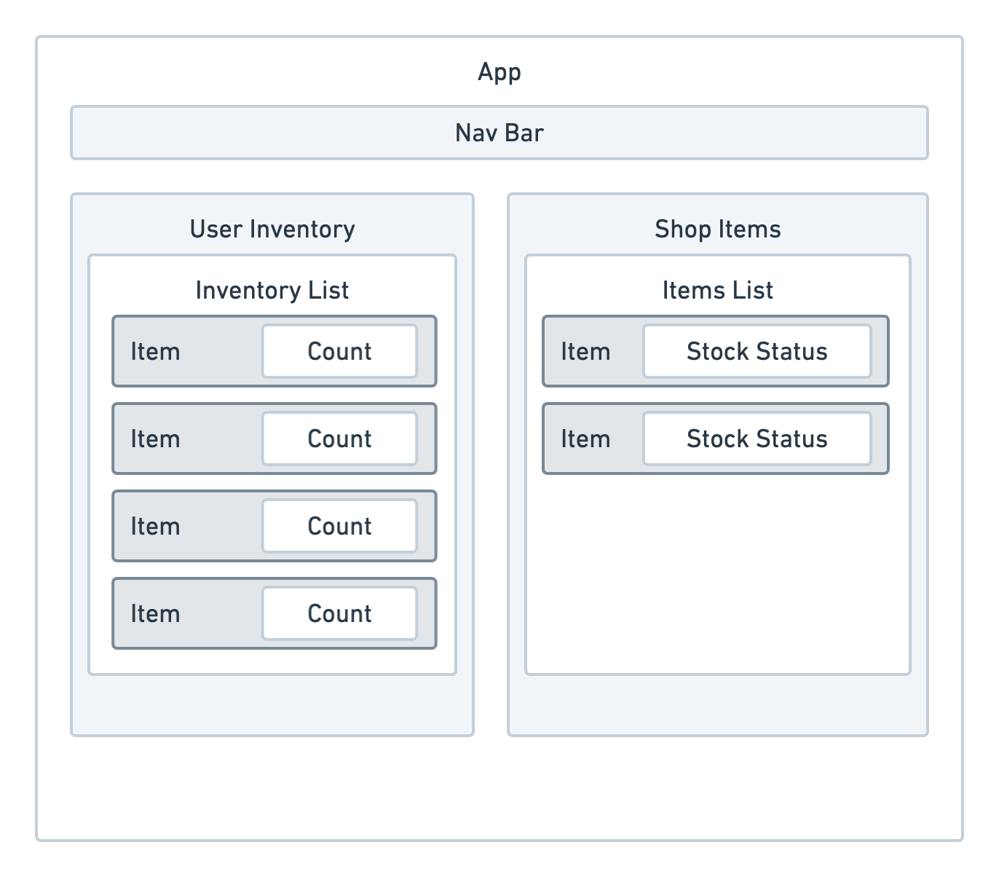
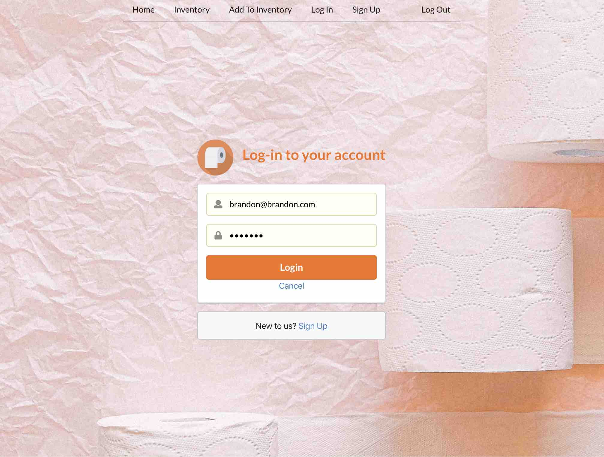
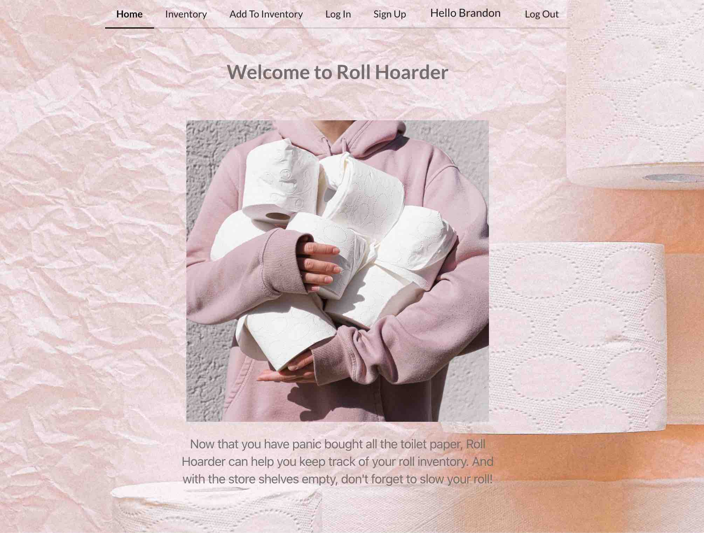
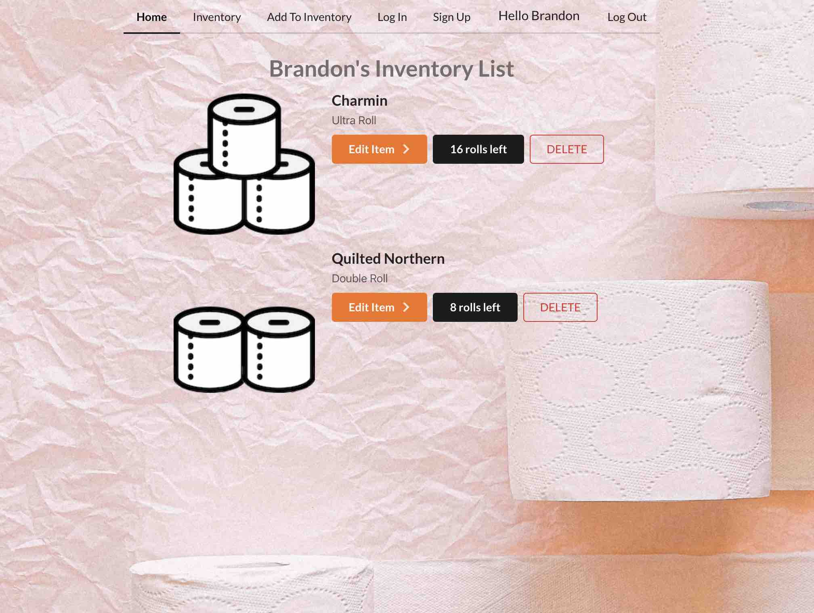

# Roll-Hoarder

### Date: 4/20/2020

#### Developed by: Brandon Carter
___________________________

### _Getting Started_:

A full-stack MERN application to keep track of your precious Toilet paper during the Coronavirus outbreak.
  
* Click [here](https://roll-hoarder.herokuapp.com/) to use the deployed app.

* Click [here](https://trello.com/b/PomVEGpQ/project-4-rollout) to view the Trello board used for planning.
_________________________________

### _Motivation_:

These are strange and frightning times for everyone during the COVID-19 pandemic. Forced to stay at home, people are panic buying all available toilet paper. With supplies running low, every roll must be accounted for. If only there were an app to assist those in need.
_________________________________

###### Entity Relationship Diagram

###### Wireframe

### ***Screenshots***

###### Log In Page

###### Home Page

###### Inventory Page

_________________________________

### _User Experience_:

* As a USer, I should be able to sign up for the app
* As a User, I should be able to add Items to my inventory when logged in.
* As a User, I should be able to see a list of my inventory items when logged in.
* As a User, I should be able to update my items when logged in.
* As a User, I should be able to delete my items when logged in.
* As a User, my inventory should be protected from other users.
* As a User, I should be able to logout.
_________________________________

### _Technology Implemented_:

* React
* Node/Express
* MongoDB/Mongoose
* HTML
* CSS
* Semantic UI
* JSON Web Token Auth
* Heroku
* GitHub
* Chajr
_________________________________

### _Credits_:

* Icons by Freepik from www.flaticon.com
* Images by Anna Shvets
* Project scaffolding using [Chajr](https://github.com/DavidStinson/chajr) by David Stinson
_________________________________
### _Upcoming Features_:

* Roll quantity incrementing/decrementing
* Create a shop where users can buy items for their inventory
* Automatically decrease roll quantity based on usage/week
* Use Twilio API to send text alert when roll count is low
* Alert user that they are hoarding when they have too many rolls
_________________________________
